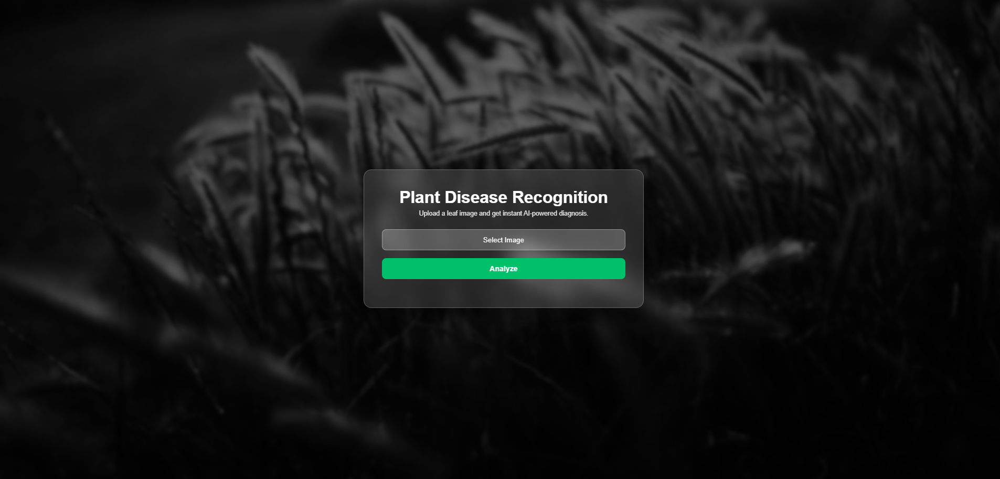

# 🌿 Potato Plant Disease Recognition


A **Deep Learning based web application** that detects **potato plant diseases** from leaf images.

Users can upload a potato leaf image and the system predicts whether the plant is **Healthy or affected by disease** using a trained TensorFlow model.


## 📷 Application Screenshot


---

# 🚀 Features

* Upload potato leaf images
* Deep learning disease detection
* Confidence score for predictions
* Cause and solution for detected disease
* Simple web interface using Flask

---

# 🛠 Technologies Used

* Python
* Flask
* TensorFlow / Keras
* HTML
* CSS
* JavaScript
* NumPy
* Pillow

---

# ⚡ Quick Start

### 1️⃣ Clone the repository

```bash
git clone https://github.com/Akshay001-A/potato-plant-disease-recognition.git
```

### 2️⃣ Go to the project folder

```bash
cd potato-plant-disease-recognition
```

### 3️⃣ Install dependencies

```bash
pip install -r requirements.txt
```

---

# 🧠 Model Download

The trained model is **not included in this repository** because it exceeds GitHub's file size limit.

Download the model from Google Drive:

https://drive.google.com/file/d/1jQLlUoyXaTr4wTnRKv-5uydloXUJnDQF/view

After downloading, place the model file inside the **models folder**.

Project structure should look like this:

```
potato-plant-disease-recognition
│
├── app.py
├── plant_disease.json
├── README.md
├── LICENSE
├── requirements.txt
│
├── models
│   └── plant_disease_recog_model1.keras
│
├── static
│   ├── css
│   └── images
│
├── templates
│   └── home.html
│
└── uploadimages
```

---

# ▶️ Run the Application

Start the Flask server:

```bash
python app.py
```

Open your browser and go to:

```
http://127.0.0.1:5000
```

Upload a potato leaf image to detect disease.

---

# 📷 Application Screenshot

You can add screenshots here to show how the application works.

Example:

```

```

---

# 📦 Requirements

```
flask
tensorflow
keras
numpy
pillow
```

Install dependencies using:

```bash
pip install -r requirements.txt
```

---

# 👨‍💻 Author

Akshay R
Charan Kumar R

---

# 📄 License

This project is licensed under the **MIT License**.

See the `LICENSE` file for more details.
